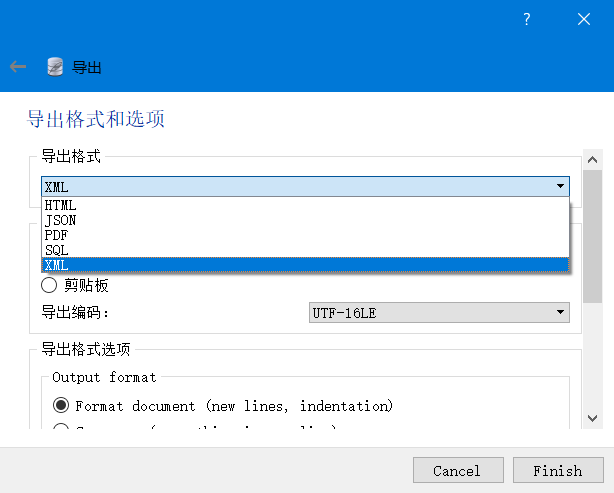
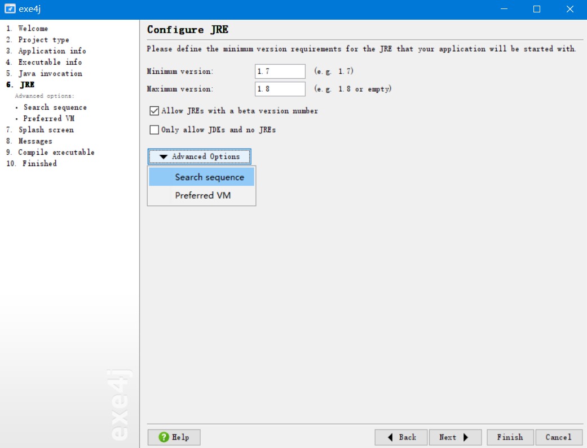
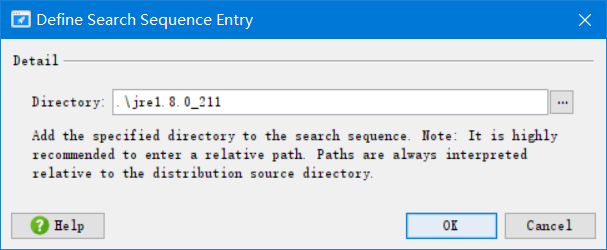

项目地址：<https://github.com/neytao/sqlitetoExcel>

**开发原因：**使用sqliteStudio打开db数据库文件，导出不包含Excel表格选项：

**使用语言：**java

**JAVA环境：**jdk1.8

**引用包：**/lib/jxl.jar、/lib/sqlite-jdbc-3.27.2.1.jar （位于本工程文件夹Lib文件夹内）

**源代码：**/src/sqlsolve.java

**JAR编译文件：**

**目的包[可执行文件]：**/out/artifacts/sqliteSolvetoExcel_jar/sqliteSolvetoExcel.jar

在查询后得知jar可以发布为exe，使用exe4j工具打包即可 

注：由网上提示，打包exe时推荐jre使用32位版本，因此在exe目录中放置jre 1.8 x32位包

**打包过程：**

**exe4j配置文件：**

使用相对路径，将jre 1.8 x32 放置和exe同一目录即可。

**成品下载：**

​	含jre：https://github.com/neytao/sqlitetoExcel/blob/master/sqlitetoxls_jre/sqlitetoxls_jre.zip

​	无jre：https://github.com/neytao/sqlitetoExcel/blob/master/sqlitetoxls_without_jre/sqlitetoxls_without_jre.zip

**使用方法：**

​	将需要转换为excel的db文件放置在本工具exe同一目录下即可。

​	